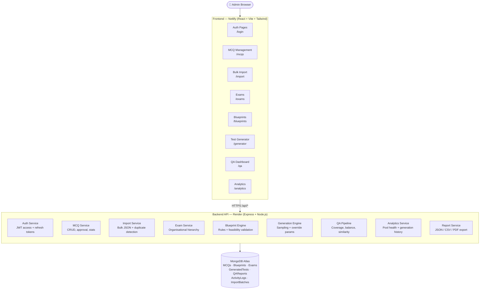

# ExamEngine
> Advanced Examination Test Construction Engine

[](https://github.com/your-org/exam-engine/actions/workflows/deploy.yml)

---

## 1. System Overview

ExamEngine is a production-grade examination test construction platform designed for large-scale academic and professional examination bodies. Its core purpose is to manage, organise, and intelligently assemble examination papers from an administrator-curated MCQ database according to precisely defined blueprints — not to generate questions with AI. Every question in the system is written and approved by a human administrator; the engine's job is to select and assemble them correctly.

The platform handles the full lifecycle of an MCQ from creation through import, review, duplicate detection, quality scoring, and approval. Once a question pool is in good health, administrators define exam blueprints that prescribe exactly how many questions to draw from each subject and difficulty band. The generation engine then samples from the approved pool according to those rules — honouring recency constraints, quality thresholds, and per-run overrides — and produces a numbered test document. Every generated test passes through a QA pipeline that checks coverage, balance, and duplicate proximity before a finalize action makes the test production-ready.

Analytics dashboards provide live visibility into pool health (question counts by subject and difficulty, recent additions, MCQ exposure frequency) and generation history, giving administrators the information they need to keep the pool growing ahead of demand. Export routes deliver finished tests as JSON, CSV, or formatted PDF. The entire system is protected by JWT authentication, role-based access control, per-route rate limiting, security headers, input sanitization against NoSQL injection, and gzip compression — designed to hold its shape as the MCQ pool grows toward the stated 1 million+ question target.

---

## 2. Architecture Diagram



---

## 3. Tech Stack

| Layer | Technology | Purpose |
|---|---|---|
| **Runtime** | Node.js 20 | Server-side JavaScript runtime |
| **API Framework** | Express 4 | HTTP routing, middleware composition |
| **Database** | MongoDB Atlas + Mongoose 8 | Document storage, schema enforcement, indexing |
| **Auth** | jsonwebtoken + bcryptjs | JWT access/refresh tokens, password hashing |
| **Security** | Helmet 7 | HTTP security headers + hardened CSP |
| **Security** | express-mongo-sanitize | NoSQL injection prevention |
| **Rate Limiting** | express-rate-limit 7 | Per-route throttling (auth, generator, general) |
| **Compression** | compression | Gzip for responses > 1 KB (skips PDF streams) |
| **File Upload** | multer | Multipart/form-data handling for JSON bulk import |
| **PDF Export** | pdfkit | Server-side PDF generation for test export |
| **Validation** | zod (server + client) | Schema-validated request bodies and query params |
| **UI Framework** | React 19 + Vite 8 | Component-based SPA with fast HMR dev server |
| **Styling** | Tailwind CSS 3 + tailwindcss-animate | Utility-first CSS, animation utilities |
| **UI Components** | Radix UI primitives + class-variance-authority | Accessible headless components |
| **Data Fetching** | @tanstack/react-query 5 | Server state, caching, background refetching |
| **Virtualisation** | @tanstack/react-virtual 3 | Windowed rendering for large MCQ lists |
| **Charts** | Recharts 3 | Analytics dashboard visualisations |
| **Forms** | react-hook-form 7 + @hookform/resolvers | Performant forms with zod validation |
| **HTTP Client** | axios 1 | Configured instance with auth interceptors |
| **Notifications** | react-hot-toast | In-app toast feedback |
| **Icons** | lucide-react | Consistent icon set |

---

## 4. Installation (Local Development)

### Prerequisites
- Node.js v20+
- npm v10+
- A MongoDB Atlas cluster (free tier is fine for development)

### Steps

```bash
# 1. Clone the repository
git clone <repo-url>
cd exam-engine

# 2. Set up server environment variables
cp .env.example server/.env
# Edit server/.env and fill in:
#   MONGO_URI          — your Atlas connection string
#   JWT_ACCESS_SECRET  — a random 48-char string
#   JWT_REFRESH_SECRET — a different random 48-char string
# All other variables have safe defaults for local dev.

# 3. Set up client environment variables (optional for local dev)
# The client uses Vite's dev-server proxy to forward /api → localhost:5000,
# so no VITE_* variables are needed for local development.
# To create the file anyway:
cp .env.example client/.env
# Only the VITE_* lines at the bottom of .env.example apply to the client.

# 4. Install server dependencies
cd server
npm install

# 5. Seed the admin user (one-time, only needed on a fresh database)
npm run seed:admin
# Creates the admin account using ADMIN_EMAIL / ADMIN_PASSWORD from server/.env
# (defaults: admin@examengine.com / change_this_in_production)
# Change the password in the UI immediately after first login.

# 6. Start the backend dev server (runs on http://localhost:5000)
npm run dev

# 7. In a second terminal, install and start the frontend
cd ../client
npm install
npm run dev
# Runs on http://localhost:5173 — Vite proxy forwards /api → localhost:5000
```

Open [http://localhost:5173](http://localhost:5173) and log in with the seeded admin credentials.

---

## 5. Environment Variables

See [`.env.example`](.env.example) for the full, commented reference — that file is the single source of truth.

**Quick summary:**

| Variable | Scope | Required | Default | Purpose |
|---|---|---|---|---|
| `NODE_ENV` | server | No | `development` | Controls logging, morgan format |
| `PORT` | server | No | `5000` | Express listen port |
| `MONGO_URI` | server | **Yes** | — | MongoDB Atlas connection string |
| `MONGO_DB_NAME` | server | No | `exam-engine` | Mongoose database name |
| `JWT_ACCESS_SECRET` | server | **Yes** | — | Signs short-lived access tokens |
| `JWT_REFRESH_SECRET` | server | **Yes** | — | Signs long-lived refresh tokens |
| `JWT_ACCESS_EXPIRY` | server | No | `15m` | Access token lifetime |
| `JWT_REFRESH_EXPIRY` | server | No | `7d` | Refresh token lifetime |
| `CORS_ORIGIN` | server | No | `http://localhost:5173` | Allowed CORS origin |
| `MAX_UPLOAD_SIZE_BYTES` | server | No | `10485760` (10 MB) | Bulk import file size cap |
| `DEFAULT_QUALITY_THRESHOLD` | server | No | `50` | Min quality score for generation |
| `RECENT_DAYS_THRESHOLD` | server | No | `30` | "Recently used" window (days) |
| `SIMILARITY_THRESHOLD` | server | No | `85` | Near-duplicate detection sensitivity |
| `ADMIN_EMAIL` | server | No | `admin@examengine.com` | Seeded admin email |
| `ADMIN_PASSWORD` | server | No | `change_this_in_production` | Seeded admin password |
| `SEED_ADMIN_EMAIL` | server | No | — | Alternative seeder email (seed:admin script) |
| `SEED_ADMIN_PASSWORD` | server | No | — | Alternative seeder password (seed:admin script) |
| `VITE_API_BASE_URL` | client | No (prod: Yes) | `/api` (via proxy) | Production API base URL |
| `VITE_APP_NAME` | client | No | `ExamEngine` | UI branding display name |

---

## 6. API Endpoint Reference

All routes are prefixed with `/api`. JWT authentication is via `Authorization: Bearer <token>` header. `Admin` role = `admin`; routes marked `Any auth` accept any authenticated user.

### Health

| Method | Path | Auth | Description |
|---|---|---|---|
| `GET` | `/api/health` | None | System health check — returns DB connection status and uptime |

### Auth

| Method | Path | Auth | Description |
|---|---|---|---|
| `POST` | `/api/auth/login` | None | Authenticate with email + password; returns access token + sets refresh cookie |
| `POST` | `/api/auth/logout` | Any auth | Invalidates the current session; clears refresh cookie |
| `POST` | `/api/auth/refresh` | None (cookie) | Issues a new access token using the httpOnly refresh cookie |
| `GET` | `/api/auth/me` | Any auth | Returns the currently authenticated user's profile |

### MCQs

All `/api/mcqs` routes require **Admin** role.

| Method | Path | Auth | Description |
|---|---|---|---|
| `GET` | `/api/mcqs` | Admin | List MCQs with filtering (subject, difficulty, status, exam_tags, text search) and pagination |
| `POST` | `/api/mcqs` | Admin | Create a single MCQ |
| `GET` | `/api/mcqs/stats` | Admin | Aggregate counts by status, subject, difficulty |
| `GET` | `/api/mcqs/topics` | Admin | List distinct topics for a given subject (`?subject=`) |
| `GET` | `/api/mcqs/:id` | Admin | Fetch a single MCQ by ObjectId |
| `PATCH` | `/api/mcqs/:id` | Admin | Update MCQ fields (partial update) |
| `DELETE` | `/api/mcqs/:id` | Admin | Delete an MCQ |
| `PATCH` | `/api/mcqs/:id/approve` | Admin | Set MCQ status to `approved` |
| `PATCH` | `/api/mcqs/:id/reject` | Admin | Set MCQ status to `rejected` |

### Import

All `/api/import` routes require **Admin** role.

| Method | Path | Auth | Description |
|---|---|---|---|
| `POST` | `/api/import/bulk` | Admin | Upload a JSON file for bulk MCQ import (multipart/form-data, field: `file`) |
| `POST` | `/api/import/validate` | Admin | Dry-run validation of a JSON file without inserting anything |
| `POST` | `/api/import/resolve` | Admin | Insert the "keep" decisions from a duplicate review (`{ batchId, keepDecisions[] }`) |
| `GET` | `/api/import/history` | Admin | List past import batches with pagination (`?page=&limit=`) |

### Exams

GETs require any authenticated user; writes require **Admin** role.

| Method | Path | Auth | Description |
|---|---|---|---|
| `GET` | `/api/exams` | Any auth | List exams with optional filters (`?status=active`) and pagination |
| `POST` | `/api/exams` | Admin | Create an exam |
| `GET` | `/api/exams/:examId` | Any auth | Fetch a single exam |
| `PUT` | `/api/exams/:examId` | Admin | Replace exam fields (full update) |
| `DELETE` | `/api/exams/:examId` | Admin | Delete an exam (fails if blueprints exist for it) |
| `PATCH` | `/api/exams/:examId/status` | Admin | Toggle exam status between `active` / `inactive` |

### Blueprints

GETs require any authenticated user; writes require **Admin** role.

| Method | Path | Auth | Description |
|---|---|---|---|
| `POST` | `/api/blueprints/validate` | Admin | Validate blueprint payload + feasibility check without saving |
| `POST` | `/api/blueprints` | Admin | Create a blueprint |
| `GET` | `/api/blueprints/exam/:examId` | Any auth | List all blueprints for an exam |
| `GET` | `/api/blueprints/:blueprintId` | Any auth | Fetch a single blueprint |
| `PUT` | `/api/blueprints/:blueprintId` | Admin | Replace blueprint (full update) |
| `DELETE` | `/api/blueprints/:blueprintId` | Admin | Delete a blueprint |
| `POST` | `/api/blueprints/:blueprintId/clone` | Admin | Clone a blueprint (increments version) |
| `PATCH` | `/api/blueprints/:blueprintId/activate` | Admin | Set as the active blueprint for its exam (deactivates the previous one) |

### Generator

GETs require any authenticated user; writes/deletes require **Admin** role.

| Method | Path | Auth | Description |
|---|---|---|---|
| `POST` | `/api/generator/generate` | Admin | Generate a test from a blueprint + optional overrides |
| `POST` | `/api/generator/check-feasibility` | Admin | Pre-flight feasibility check (same body as generate, no side effects) |
| `GET` | `/api/generator` | Any auth | List generated tests with pagination and filters |
| `GET` | `/api/generator/:testId` | Any auth | Fetch a single generated test with resolved MCQ content |
| `DELETE` | `/api/generator/:testId` | Admin | Delete a generated test |

### QA

GETs require any authenticated user; mutation routes require **Admin** role.

| Method | Path | Auth | Description |
|---|---|---|---|
| `GET` | `/api/qa/similar/:questionId` | Any auth | Find MCQs similar to a given question (near-duplicate search) |
| `POST` | `/api/qa/pairs/dismiss` | Admin | Dismiss a near-duplicate pair so it no longer appears in reviews |
| `POST` | `/api/qa/:testId/run` | Admin | Manually trigger a QA run on a generated test |
| `GET` | `/api/qa/:testId/latest` | Any auth | Fetch the latest QA report for a test |
| `GET` | `/api/qa/:testId/history` | Any auth | Fetch all QA reports for a test (full history) |
| `POST` | `/api/qa/:testId/finalize` | Admin | Finalize a test (only succeeds if latest QA report is passing) |

### Analytics

All `/api/analytics` routes require **Admin** role.

| Method | Path | Auth | Description |
|---|---|---|---|
| `GET` | `/api/analytics/overview` | Admin | Pool overview: total MCQs, approved count, pending, rejected, recent additions |
| `GET` | `/api/analytics/subjects` | Admin | MCQ counts grouped by subject (`?blueprintId=` for blueprint-scoped view) |
| `GET` | `/api/analytics/difficulty` | Admin | MCQ counts grouped by difficulty level |
| `GET` | `/api/analytics/exposure` | Admin | Most/least used MCQs by used_count (`?type=most|least&limit=`) |
| `GET` | `/api/analytics/generation-history` | Admin | Test generation counts over time (`?months=&examId=`) |
| `GET` | `/api/analytics/trends` | Admin | Question approval trend over the last N periods |
| `GET` | `/api/analytics/activity-logs` | Admin | Paginated activity log (`?page=&limit=&action=&entityType=&actorId=&from=&to=`) |

### Reports

All `/api/reports` routes require **Admin** role.

| Method | Path | Auth | Description |
|---|---|---|---|
| `GET` | `/api/reports/test/:testId/json` | Admin | Download generated test as JSON |
| `GET` | `/api/reports/test/:testId/csv` | Admin | Download generated test as CSV |
| `GET` | `/api/reports/test/:testId/pdf` | Admin | Download generated test as PDF (streamed) |
| `GET` | `/api/reports/blueprint/:blueprintId` | Admin | Download blueprint compliance report as PDF |

---

## 7. MCQ JSON Schema

This is the schema enforced by [`server/src/models/MCQ.js`](server/src/models/MCQ.js). Fields marked **required** must be present in every MCQ.

```json
{
  "question": "Which of the following correctly describes the role of the mitotic spindle during cell division?",
  "options": {
    "A": "It replicates the DNA before cell division begins",
    "B": "It separates sister chromatids by pulling them toward opposite poles",
    "C": "It produces ATP to fuel the division process",
    "D": "It dissolves the nuclear membrane at the start of prophase"
  },
  "correct_answer": "B",
  "subject": "Biology",
  "topic": "Cell Division",
  "subtopic": "Mitosis",
  "difficulty": "medium",
  "exam_tags": ["MDCAT", "NMDCAT"],
  "cognitive_level": "understanding",
  "quality_score": 78
}
```

### Field Reference

| Field | Type | Required | Enum / Constraints | Default | Notes |
|---|---|---|---|---|---|
| `question` | String | **Yes** | — | — | The question stem. Trimmed. |
| `options.A` | String | **Yes** | — | — | Option A text |
| `options.B` | String | **Yes** | — | — | Option B text |
| `options.C` | String | **Yes** | — | — | Option C text |
| `options.D` | String | **Yes** | — | — | Option D text |
| `correct_answer` | String | **Yes** | `A`, `B`, `C`, `D` | — | Must match a non-empty option key |
| `subject` | String | **Yes** | — | — | Broad subject area (e.g. "Biology") |
| `topic` | String | No | — | `""` | Sub-area within subject |
| `subtopic` | String | No | — | `""` | Further refinement |
| `difficulty` | String | **Yes** | `easy`, `medium`, `hard` | — | |
| `exam_tags` | String[] | No | — | `[]` | Exam identifiers (e.g. `["MDCAT"]`) |
| `cognitive_level` | String | No | `recall`, `understanding`, `application`, `analysis` | `recall` | Bloom's taxonomy level |
| `quality_score` | Number | No | 0–100 | `50` | Set by admin during review |
| `status` | String | No | `pending`, `approved`, `rejected` | `pending` | Managed via approve/reject endpoints |

**Auto-generated fields (never set by client input):**

| Field | Description |
|---|---|
| `question_id` | Human-readable ID (e.g. `Q00042`), assigned on create |
| `question_hash` | SHA-256 of normalised question text, used for exact-duplicate detection |
| `used_count` | Incremented each time this MCQ appears in a generated test |
| `last_used_at` | Timestamp of last use in generation |

---

## 8. Blueprint JSON Schema

This is the schema enforced by [`server/src/models/Blueprint.js`](server/src/models/Blueprint.js).

```json
{
  "blueprint_id": "BP-MDCAT-2026-STD",
  "exam_id": "MDCAT-2026",
  "total_questions": 200,
  "subjects": [
    { "name": "Biology",   "count": 80 },
    { "name": "Chemistry", "count": 60 },
    { "name": "Physics",   "count": 40 },
    { "name": "English",   "count": 20 }
  ],
  "difficulty_distribution": {
    "easy":   40,
    "medium": 120,
    "hard":   40
  },
  "selection_rules": {
    "exclude_used_within_days": 90,
    "min_quality_score": 60
  }
}
```

### Field Reference

| Field | Type | Required | Constraints | Default | Notes |
|---|---|---|---|---|---|
| `blueprint_id` | String | **Yes** | Unique | — | Stable public identifier |
| `exam_id` | String | **Yes** | — | — | References an Exam's stable string ID |
| `total_questions` | Number | **Yes** | ≥ 1 | — | Total MCQs to draw |
| `subjects` | Array | No | Each: `{ name: String, count: Number ≥ 0 }` | `[]` | Subject quotas |
| `difficulty_distribution` | Object | No | `{ easy, medium, hard }` each ≥ 0 | `{}` | Difficulty quotas |
| `selection_rules` | Mixed | No | Open-ended object | `{}` | Custom generator hints |
| `version` | Number | Auto | — | `1` | Incremented on clone |
| `is_active` | Boolean | Auto | — | `false` | Only one active per exam at a time |
| `created_by` | String | Auto | — | — | Set by the creating admin |

---

## 9. Generated Test Output Format

A generated test as returned by `GET /api/generator/:testId`.

```json
{
  "test_id": "TEST_2026_001",
  "exam_id": "MDCAT-2026",
  "blueprint_id": "BP-MDCAT-2026-STD",
  "question_count": 200,
  "status": "completed",
  "generated_by": "admin@examengine.com",
  "generated_at": "2026-08-01T08:30:00.000Z",
  "generation_params": {
    "quality_threshold": 60,
    "override_difficulty": null
  },
  "latest_qa_status": "passed",
  "latest_qa_report_id": "QAR_2026_001_01",
  "finalized": true,
  "finalized_at": "2026-08-01T09:15:00.000Z",
  "questions": [
    {
      "mcq_id": "Q00042",
      "subject": "Biology",
      "difficulty": "medium",
      "question": "Which of the following correctly describes the role of the mitotic spindle...",
      "options": {
        "A": "It replicates the DNA before cell division begins",
        "B": "It separates sister chromatids by pulling them toward opposite poles",
        "C": "It produces ATP to fuel the division process",
        "D": "It dissolves the nuclear membrane at the start of prophase"
      },
      "correct_answer": "B",
      "topic": "Cell Division",
      "cognitive_level": "understanding"
    }
  ]
}
```

**Key fields (Phase 8 additions):**

| Field | Description |
|---|---|
| `latest_qa_status` | Denormalised from the latest QAReport: `passed`, `failed`, or `not_run` |
| `latest_qa_report_id` | ID of the most recent QA report for fast linking |
| `finalized` | `true` only after an admin calls `POST /api/qa/:testId/finalize` AND the latest QA report is passing |
| `finalized_at` | Timestamp of finalization |

---

## 10. Deployment Guide

### Step 1 — MongoDB Atlas

1. Create a free cluster at [cloud.mongodb.com](https://cloud.mongodb.com).
2. Create a database user (Database Access → Add New User) with read/write permissions.
3. Whitelist IPs: Network Access → Add IP Address → `0.0.0.0/0` (for Render's dynamic IPs) or add Render's static outbound IPs if your plan supports them.
4. Copy the connection string: Clusters → Connect → "Connect your application" → Node.js driver → copy URI.
5. Replace `<username>`, `<password>`, and the database name in the URI.

### Step 2 — Render (Backend)

1. Go to [dashboard.render.com](https://dashboard.render.com) → New → Web Service.
2. Connect your GitHub repo, select the `exam-engine` repository.
3. Configure:
   - **Root directory**: `server`
   - **Build command**: `npm install`
   - **Start command**: `npm start`
   - **Node version**: 20
4. Under **Environment Variables**, add every server variable from `.env.example` with real production values (especially `MONGO_URI`, `JWT_ACCESS_SECRET`, `JWT_REFRESH_SECRET`, `CORS_ORIGIN` pointing to your Netlify URL, `NODE_ENV=production`).
5. Under **Settings → Deploy Hook**, copy the deploy hook URL — you'll need it for the GitHub secret `RENDER_DEPLOY_HOOK_URL`.
6. Deploy. Once live, note your service URL (e.g. `https://exam-engine-api.onrender.com`).

### Step 3 — Netlify (Frontend)

1. Go to [app.netlify.com](https://app.netlify.com) → Add new site → Import an existing project → GitHub.
2. Select the `exam-engine` repository.
3. Configure:
   - **Base directory**: `client`
   - **Build command**: `npm run build`
   - **Publish directory**: `client/dist`
4. Under **Site configuration → Environment variables**, add:
   - `VITE_API_BASE_URL` = `https://exam-engine-api.onrender.com/api`
5. Add a `client/public/_redirects` file with the following content so React Router works on direct URL loads:
   ```
   /api/*  https://exam-engine-api.onrender.com/api/:splat  200
   /*      /index.html                                       200
   ```
6. After the site is created, go to **Site configuration → Site details** and copy the **API ID** — this is `NETLIFY_SITE_ID`.
7. Go to **User Settings → Applications → Personal access tokens** and create a new token — this is `NETLIFY_AUTH_TOKEN`.

### Step 4 — GitHub Secrets

In your GitHub repo: **Settings → Secrets and variables → Actions → New repository secret**, add:

| Secret name | Value |
|---|---|
| `RENDER_DEPLOY_HOOK_URL` | The deploy hook URL from Step 2 |
| `VITE_API_BASE_URL` | `https://exam-engine-api.onrender.com/api` |
| `NETLIFY_AUTH_TOKEN` | Personal access token from Step 3 |
| `NETLIFY_SITE_ID` | API ID from Step 3 |

### Step 5 — Branch Protection (one-time)

GitHub → your repo → **Settings → Branches → Add branch protection rule**:
- Branch name pattern: `main`
- ✅ Require status checks to pass before merging
- Search and select: `lint-and-test (server)` and `lint-and-test (client)`
- ✅ Require branches to be up to date before merging
- Save changes.

### Step 6 — First Deploy

```bash
git add .
git commit -m "chore: add CI/CD pipeline and final documentation"
git push origin main
```

Watch the **Actions** tab in GitHub. A green `CI/CD` run with all three jobs passing confirms the pipeline is wired up correctly.

---

## 11. Bulk Import Guide

The bulk import endpoint (`POST /api/import/bulk`) accepts a JSON file upload via `multipart/form-data` with a field named `file`.

### JSON Format

The file must be a JSON array of MCQ objects. Each object follows the MCQ schema from Section 7.

```json
[
  {
    "question": "What is the primary function of haemoglobin?",
    "options": {
      "A": "Clotting blood at wound sites",
      "B": "Transporting oxygen from lungs to tissues",
      "C": "Producing white blood cells",
      "D": "Filtering waste from the blood"
    },
    "correct_answer": "B",
    "subject": "Biology",
    "topic": "Blood",
    "subtopic": "Haematology",
    "difficulty": "easy",
    "exam_tags": ["MDCAT"],
    "cognitive_level": "recall",
    "quality_score": 85
  },
  {
    "question": "...",
    "...": "..."
  }
]
```

### Field Rules

| Field | Required | Enum / Format |
|---|---|---|
| `question` | **Yes** | Non-empty string |
| `options.A` – `options.D` | **Yes** | Non-empty strings for all four |
| `correct_answer` | **Yes** | Must be `A`, `B`, `C`, or `D` |
| `subject` | **Yes** | Non-empty string |
| `topic` | No | String, defaults to `""` |
| `subtopic` | No | String, defaults to `""` |
| `difficulty` | **Yes** | `easy`, `medium`, or `hard` |
| `exam_tags` | No | Array of strings (e.g. `["MDCAT", "NMDCAT"]`), defaults to `[]` |
| `cognitive_level` | No | `recall`, `understanding`, `application`, or `analysis` |
| `quality_score` | No | Integer 0–100, defaults to `50` |

### Error Handling Behaviour

The import pipeline uses a **row-level skip** strategy — it is NOT an all-or-nothing transaction:

- **Malformed rows** (missing required fields, invalid enum values, schema validation failures) are **skipped with a report line** in the `failed` array of the response. The rest of the batch continues processing.
- **Exact duplicates** (matching SHA-256 hash of normalised question text) are held in a `duplicates.exact` array in the response and NOT inserted. The admin reviews and resolves them via `POST /api/import/resolve`.
- **Near-duplicates** (Levenshtein similarity above the configured `SIMILARITY_THRESHOLD`) are similarly held in `duplicates.near` for admin review.
- The **validate-only mode** (`POST /api/import/validate`, or `POST /api/import/bulk` with `mode: validate_only` in the form body) runs the full pipeline — schema checks, exact-duplicate detection, near-duplicate detection — but writes nothing to the database. Use this for a dry run before committing a large batch.

### Import Response Shape

```json
{
  "success": true,
  "statusCode": 200,
  "message": "Import processed",
  "data": {
    "batch_id": "BATCH_2026_001",
    "total": 500,
    "inserted": 487,
    "failed": [
      { "row": 12, "reason": "missing required field: correct_answer" },
      { "row": 47, "reason": "difficulty must be easy | medium | hard" }
    ],
    "duplicates": {
      "exact": [
        { "row": 23, "matching_question_id": "Q00142" }
      ],
      "near": [
        { "row": 78, "similar_to": "Q00211", "similarity": 92 }
      ]
    }
  }
}
```

---

## 12. Production Verification

> This section records the actual smoke test run against the live production deployment.

### Checklist

The production smoke test should be run against the live Render backend and Netlify frontend URLs immediately after the first successful pipeline deploy. Walk through each item and record the actual result.

| # | Check | Expected | Result |
|---|---|---|---|
| 1 | Frontend loads at the Netlify URL with no console errors | HTTP 200, no JS errors | ⬜ Pending |
| 2 | `GET {render-url}/api/health` returns 200 with `database.connected: true` | `{ "database": { "connected": true } }` | ⬜ Pending |
| 3 | Admin can log in against the production database | 200 response, access token returned | ⬜ Pending |
| 4 | Creating one MCQ succeeds | MCQ created, `question_id` assigned | ⬜ Pending |
| 5 | Creating one blueprint and one exam succeeds | Blueprint saved, visible in list | ⬜ Pending |
| 6 | Generating one test from the blueprint succeeds | `status: completed`, `question_count > 0` | ⬜ Pending |
| 7 | QA auto-runs (or manual run succeeds) and shows a real pass/fail | QA report visible with checks listed | ⬜ Pending |
| 8 | Analytics dashboard shows live counts matching what was just created | MCQ count ≥ 1, generation history shows the test | ⬜ Pending |
| 9 | Exporting the generated test as PDF downloads a valid file | Content-Type: `application/pdf`, non-empty file | ⬜ Pending |
| 10 | Rate limiting headers are present on a live request | `RateLimit-Limit`, `RateLimit-Remaining` in response headers | ⬜ Pending |
| 11 | HTTPS enforced on both frontend and backend URLs | No mixed-content warnings, no plain HTTP fallback | ⬜ Pending |

> **Note for operator:** Replace each `⬜ Pending` with `✅ Pass` or `❌ Fail — <notes>` after executing the smoke test against the live URLs. This checklist, once completed, serves as the permanent go-live record.

---

## 13. Project Status

All 10 phases complete:

| Phase | Description | Status |
|---|---|---|
| 1 | Project scaffold, Express + MongoDB setup | ✅ Done |
| 2 | Authentication (JWT access + refresh tokens, admin seeder) | ✅ Done |
| 3 | MCQ CRUD, approval workflow, quality scoring | ✅ Done |
| 4 | Bulk JSON import, duplicate detection, resolve workflow | ✅ Done |
| 5 | Exam + Blueprint management | ✅ Done |
| 6 | Test Generation Engine (sampling, overrides) | ✅ Done |
| 7 | Feasibility pre-flight check, generation overrides | ✅ Done |
| 8 | QA Pipeline (coverage, balance, near-duplicate), finalize | ✅ Done |
| 9 | Analytics dashboard, activity logs, report exports | ✅ Done |
| 10 | Security hardening, performance, CI/CD, documentation | ✅ Done |
